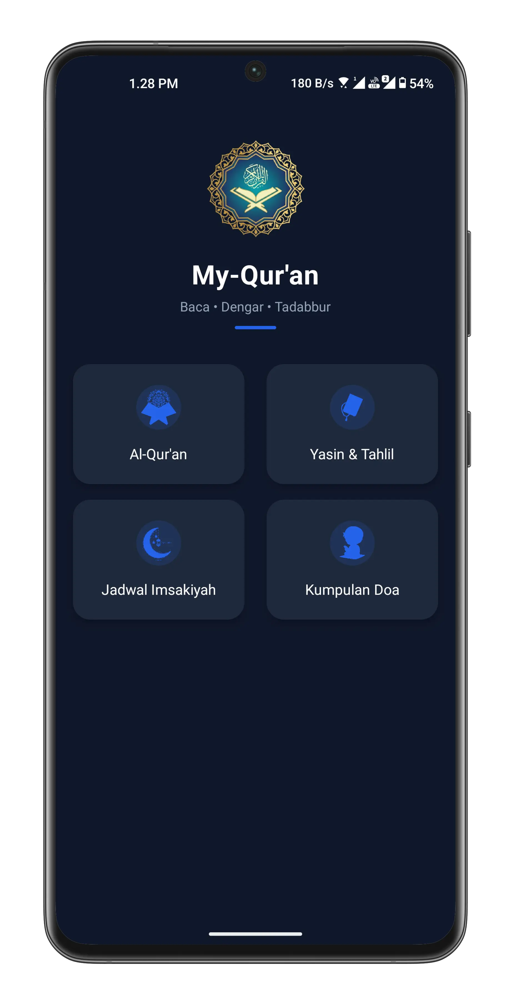
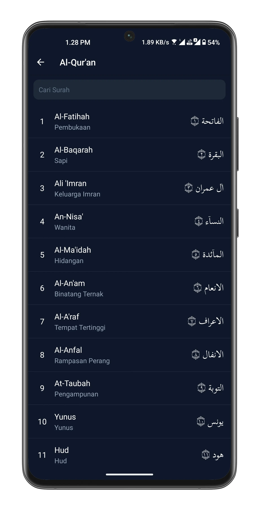
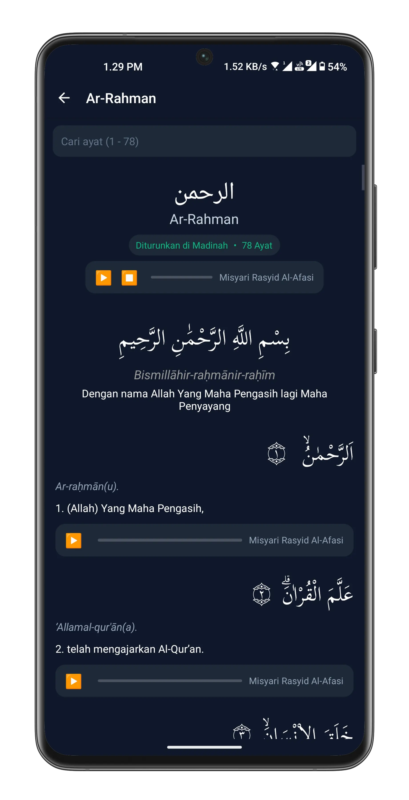
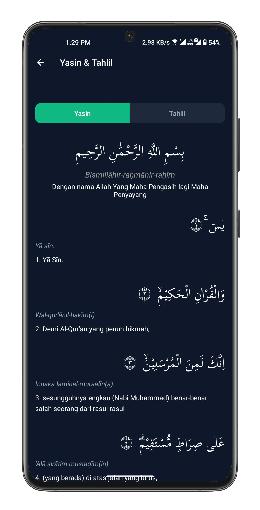
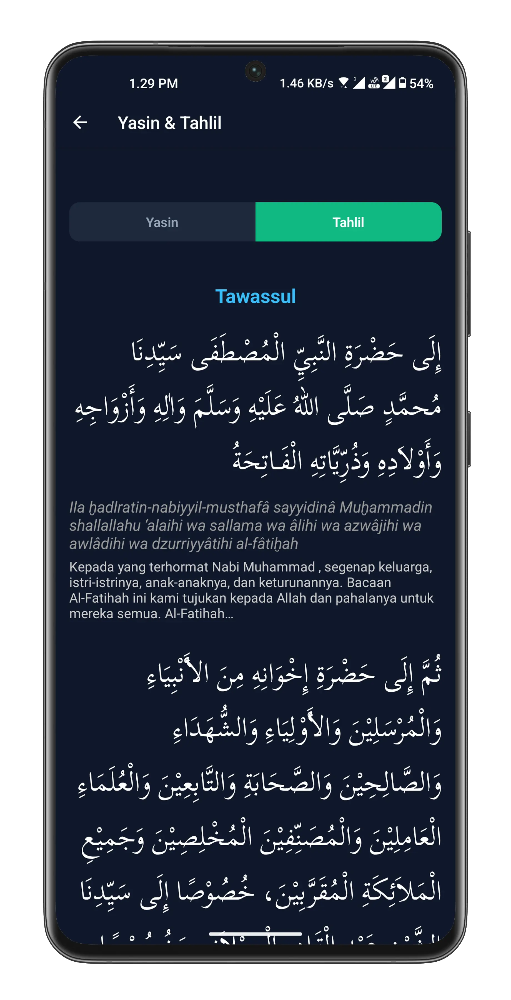
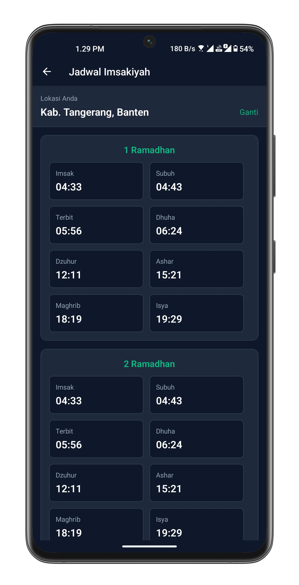
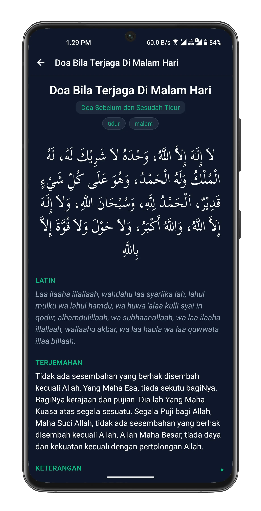

# 📖 My-Quran

A comprehensive digital Al-Qur'an application built with React Native that provides complete access to all surahs of the Al-Qur'an with Arabic text, Latin transliteration, Indonesian translation, Qori audio recitation, and special Ramadhan features.

## ✨ Features

### 📕 Digital Al-Qur'an

- Complete 30 Juz with all 114 Surahs
- Original Arabic text with proper tajweed
- Latin transliteration for easy reading
- Indonesian translation
- Qori audio recitation for each verse with playback controls
- **Search bar** to quickly find specific surah
- **Verse search** to find specific ayat
- Easy navigation between surahs and verses

### 🕌 Yasin & Tahlil

- Complete Surah Yasin with Arabic text
- Full Tahlil recitation text
- Latin transliteration and Indonesian translation
- Perfect for daily spiritual practices

### 🤲 Kumpulan Doa (Prayer Collection)

- Comprehensive collection of daily Islamic prayers
- Arabic text with Latin transliteration
- Indonesian translation for each prayer
- Detailed context and occasions for each prayer
- **Search bar** to quickly find specific prayers
- Easy-to-use categorization

### 🌙 Special Ramadhan Feature: Imsakiyah Schedule

- Complete 30-day Ramadhan prayer schedule
- **Auto-detect location via GPS** for accurate prayer times
- Manual location selection for flexibility
- Daily Imsak, Fajr, Dhuhr, Asr, Maghrib, and Isha times
- Location-based calculations ensuring accuracy

## 📱 Screenshots

<p align="center"><strong>Home</strong></p>
<p align="center">
  
</p>

<p align="center"><strong>Quran</strong></p>
<p align="center">
  
  
</p>

<p align="center"><strong>Yasin & Tahlil</strong></p>
<p align="center">
  
  
</p>

<p align="center"><strong>Imsakiyah</strong></p>
<p align="center">
  
</p>

<p align="center"><strong>Doa</strong></p>
<p align="center">
  
</p>

## 🛠️ Tech Stack

- **Framework**: React Native (Expo)
- **Language**: TypeScript
- **Platform**: Android
- **API**: [Equran.id API v2](https://equran.id/apidev/v2)
- **Location Services**: Expo Location for GPS functionality

## 📋 Prerequisites

Make sure you have installed:

- Node.js (v14 or higher)
- npm or yarn
- Expo CLI
- Android Studio (for emulator) or Expo Go app for physical device

## 🚀 Installation

1. Clone this repository

```bash
git clone https://github.com/Codenames-Ren/My-Quran.git
cd My-Quran
```

2. Install dependencies

```bash
npm install
```

3. Start the application

```bash
npm start
```

4. Run the app:
   - Press `a` for Android emulator
   - Scan QR code with Expo Go on your Android device

## 📁 Project Structure

```
My-Quran/
├── app/                      # Main application screens (Expo Router)
│   ├── doa/                 # Prayer collection screens
│   ├── imsak/               # Imsakiyah schedule screens
│   ├── quran/               # Quran reader screens
│   └── yasin-tahlil/        # Yasin & Tahlil screens
├── assets/                   # Images, fonts, icons
│   ├── fonts/               # Custom fonts
│   ├── icons/               # App icons
│   └── images/              # Images and illustrations
├── components/               # Reusable UI components
│   ├── doa/                 # Prayer-related components
│   ├── imsak/               # Imsakiyah components
│   ├── quran/               # Quran reader components
│   └── ui/                  # General UI components
├── src/                      # Core source code
│   ├── api/                 # API integration & services
│   ├── constants/           # App constants
│   ├── data/                # Static data and configurations
│   ├── hooks/               # Custom React hooks
│   ├── styles/              # Global styles and themes
│   └── utils/               # Helper functions
├── scripts/                  # Build and utility scripts
├── app.json                  # Expo configuration
├── package.json              # Dependencies
└── tsconfig.json             # TypeScript configuration
```

## 🌐 API Reference

This application uses [Equran.id API](https://equran.id)

### Main Endpoints:

- `https://equran.id/api/v2/surat` - Get list of all surahs
- `https://equran.id/api/v2/surat/{number}` - Get specific surah details with verses and audio
- `https://equran.id/api/doa` - Get collection of Islamic prayers (doa)
- `https://equran.id/api/v2/imsakiyah/{provinsi}/{tahun}` - Get Ramadhan Imsakiyah schedule by province and year

API integration is handled in the `src/api` directory.

## 🎯 Key Features Implementation

### Audio Player

- Play/pause verse recitation
- Auto-play next verse
- Volume control
- Smooth playback experience

### Location-Based Imsakiyah

- GPS auto-detection for accurate location
- Manual city/province selection
- Precise prayer time calculations based on coordinates
- 30-day Ramadhan schedule

### Responsive Design

- Optimized for various Android screen sizes
- Smooth scrolling for long content
- Beautiful Arabic typography
- Clean and modern UI/UX

## 🤝 Contributing

Contributions, issues, and feature requests are welcome!

1. Fork this repository
2. Create a new branch (`git checkout -b feature/AmazingFeature`)
3. Commit your changes (`git commit -m 'Add some AmazingFeature'`)
4. Push to the branch (`git push origin feature/AmazingFeature`)
5. Create a Pull Request

## 📄 License

This is an open-source project designed to help fellow Muslims access Islamic resources easily and conveniently.

## 🎓 Learning Resources

This project demonstrates:

- React Native with Expo and TypeScript
- Expo Router for navigation
- API integration and data fetching
- Audio playback implementation
- GPS and location services
- State management with React hooks
- Component-based architecture

## 👨‍💻 Developer

**Codenames-Ren**

- GitHub: [@Codenames-Ren](https://github.com/Codenames-Ren)

## 🙏 Acknowledgments

- [Equran.id](https://equran.id) for the comprehensive Al-Qur'an API
- Expo team for the powerful framework
- React Native community
- All open source contributors
- Indonesian Muslim developers community

## 📮 Support

If you find this app helpful, please:

- ⭐ Star this repository
- 🐛 Report bugs or request features via Issues
- 🤲 Make du'a for the developer and all contributors

---

**Made with ❤️ and ☪️ to help Muslims access the Al-Qur'an and Islamic resources easily**

_"The best among you are those who learn the Quran and teach it." - Prophet Muhammad ﷺ_
